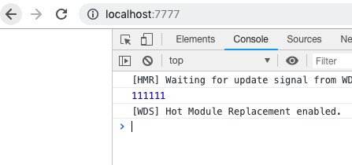
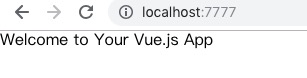
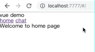
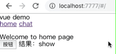
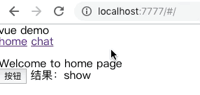
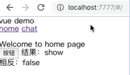

# webpack4 + vue + vue-router + vuex

ps:
1. 所有案例使用的 node 及 npm 版本如下
    - node版本: v8.4.0
    - npm: 5.3.0
2. 下一个案例默认是接着上一个继续写的
3. 建议先熟悉以下文档
    - [vue](https://cn.vuejs.org/v2/guide/components.html)
    - [vue-router](https://router.vuejs.org/zh/)
    - [vuex](https://vuex.vuejs.org/zh/guide/)
    - [webpack4](https://webpack.css88.com/concepts/entry-points.html)
    - [es6](http://es6.ruanyifeng.com/)
4. 建议使用 [cnpm](https://npm.taobao.org/) 替代 npm 


-----


## 一、webpack4 + vue 搭建项目

先搭建一个简单的项目，能够运行起来

新建项目目录如下
```
[demo]
  |-- common
    |-- reset.less
  |-- src
    |-- index.js
    |-- index.html
  |-- package.json
  |-- webpack.config.js
```

运行 $ npm init 全部回车后结果如下

<font color="deeppink">demo/package.json</font>
```json
{
  "name": "demo",
  "version": "1.0.0",
  "description": "",
  "main": "webpack.config.js",
  "scripts": {
    "test": "echo \"Error: no test specified\" && exit 1"
  },
  "author": "",
  "license": "ISC"
}
```

reset css 的代码大家可以找别的，这里贴的代码也是从[网上copy过来的](https://blog.csdn.net/weixin_41754739/article/details/80390851)

<font color="deeppink">demo/common/reset.less</font>
```less
html, body, div, span, applet, object, iframe,
h1, h2, h3, h4, h5, h6, p, blockquote, pre,
a, abbr, acronym, address, big, cite, code,
del, dfn, em, img, ins, kbd, q, s, samp,
small, strike, strong, sub, sup, tt, var,
b, u, i, center,
dl, dt, dd, ol, ul, li,
fieldset, form, label, legend,
table, caption, tbody, tfoot, thead, tr, th, td,
article, aside, canvas, details, embed, 
figure, figcaption, footer, header, hgroup, 
menu, nav, output, ruby, section, summary,
time, mark, audio, video {
  margin: 0;
  padding: 0;
  border: 0;
  font-size: 100%;
  font: inherit;
  vertical-align: baseline;
}

article, aside, details, figcaption, figure, 
footer, header, hgroup, menu, nav, section {
  display: block;
}
body {
  line-height: 1;
}
ol, ul {
  list-style: none;
}
blockquote, q {
  quotes: none;
}
blockquote:before, blockquote:after,
q:before, q:after {
  content: '';
  content: none;
}
table {
  border-collapse: collapse;
  border-spacing: 0;
}
```

写一个简单的 html 和 js，如下

<font color="deeppink">demo/src/index.html</font>
```html
<!DOCTYPE html>
<html lang="en">
<head>
  <meta charset="UTF-8">
  <meta name="viewport" content="width=device-width, initial-scale=1.0">
  <meta http-equiv="X-UA-Compatible" content="ie=edge">
  <title>demo</title>
</head>
<body>
  <div id="root"></div>
</body>
</html>
```

<font color="deeppink">demo/src/index.js</font>
```js
import './common/reset.less';
console.log(111111)
```


下面安装依赖
- js相关
  $ npm i babel-core babel-loader babel-preset-es2015 babel-preset-stage-0 -D
- 样式相关
  $ npm i css-loader less less-loader autoprefixer-loader mini-css-extract-plugin -D
- html 相关
  $ npm i html-webpack-plugin -D
- 图片和图标相关
  $ npm i file-loader url-loader -D
- webpack相关
  $ npm i webpack webpack-cli webpack-dev-server -D

然后在 package.json 里的 scripts 字段里增加启动服务(webpack-dev-server)和构建(webpack -p)的命令，如下

<font color="deeppink">demo/package.json</font>
```json
{
  "name": "demo",
  "version": "1.0.0",
  "description": "",
  "main": "webpack.config.js",
  "scripts": {
    "dev": "webpack-dev-server",
    "build": "webpack -p"
  },
  "author": "",
  "license": "ISC",
  "devDependencies": {
    "autoprefixer-loader": "^3.2.0",
    "babel-core": "^6.26.3",
    "babel-loader": "^7.1.5",
    "babel-preset-es2015": "^6.24.1",
    "babel-preset-stage-0": "^6.24.1",
    "css-loader": "^1.0.1",
    "file-loader": "^2.0.0",
    "html-webpack-plugin": "^3.2.0",
    "less": "^3.8.1",
    "less-loader": "^4.1.0",
    "mini-css-extract-plugin": "^0.4.4",
    "url-loader": "^1.1.2",
    "webpack": "^4.26.0",
    "webpack-cli": "^3.1.2",
    "webpack-dev-server": "^3.1.10"
  }
}
```

注意这里 babel-loader 的版本号是 "^7.1.5"，否则会有如下报错： 
> Error: Cannot find module '@babel/core'
 babel-loader@8 requires Babel 7.x (the package '@babel/core').If you'd like to use Babel 6.x ('babel-core'), you should install 'babel-loader@7'.

下面写 webpack.config.js 先贴下完整的代码
<font color="deeppink">demo/webpack.config.js</font>
```js
var webpack = require('webpack');
var HtmlWebpackPlugin = require('html-webpack-plugin');
var MiniCssExtractPlugin = require('mini-css-extract-plugin');

module.exports = {
  mode: 'production',
  entry: {
    index: './src/index.js',
  },
  output: {
    path: __dirname + "/build",
    filename: '[name].[hash].js'
  },
  module: {
    rules: [
      {
        test: /\.js$/,
        loader: 'babel-loader',
        options: {
          presets: ['es2015', 'stage-0'],
        }
      },
      {
        test: /\.less$/,
        use: [
          MiniCssExtractPlugin.loader,
          'css-loader',
          'less-loader',
        ],
      },
      {
        test: /\.(png|jpg|gif|ttf)$/,
        loader: 'url-loader',
        options: {
          name: 'img/[name].[ext]?[hash:7]'
        }
      },
    ]
  },
  devServer: {
    contentBase: './build',
    inline: true,
    hot: true,
    port: 7777,
  },
  plugins: [
    new webpack.HotModuleReplacementPlugin(),
    new HtmlWebpackPlugin({
      template: './src/index.html',
      chunks: ['index']
    }),
    
    new MiniCssExtractPlugin({
      filename: '[name].css'
    }),
  ]
}
```

- mode
  告知 webpack 使用相应模式的内置优化，值为 production、development

- entry
  入口文件，值可以是 string、array、object。这里的入口文件就是 `demo/src/index.js`

- output 
  输出，值是 object。
  + filename：用于输出文件的文件名。
  + path：目标输出目录 path 的绝对路径。

- [module.rules](https://webpack.css88.com/concepts/loaders.html)
  创建模块时，匹配请求的规则数组。这些规则能够修改模块的创建方式。这些规则能够对模块(module)应用 loader，或者修改解析器(parser)。   
  上面的数组中依次是对：".js 结尾的文件"、".less 结尾的文件"、"图片和图标" 的处理

- [plugins](https://webpack.css88.com/concepts/plugins.html)
  插件
  + `new webpack.HotModuleReplacementPlugin()` 模块热替换插件
  + `new HtmlWebpackPlugin()` 自动生成html的插件
  + `new MiniCssExtractPlugin()` css压缩并单独打包插件


运行 $ npm run dev , 并打开 http://localhost:7777 , 结果如下所示




-----


### 案例1

新增文件如下
```
[demo]
  |-- src
    |-- components
      |-- app.vue
```

先安装 vue 相关的依赖
- $ npm i vue --save
- $ npm i vue-loader vue-hot-reload-api vue-template-compiler --save-dev

安装以后，package.json 里就会多出来以下部分

<font color="deeppink">demo/package.json</font>
```json
{
  ...
  "devDependencies": {
    ...
    "vue-hot-reload-api": "^2.3.1",
    "vue-loader": "^15.4.2",
    "vue-template-compiler": "^2.5.17"
  },
  "dependencies": {
    "vue": "^2.5.17"
  }
}
```

webpack.config.js 里增加关于 vue 的配置
<font color="deeppink">demo/webpack.config.js</font>
```js
...
var VueLoaderPlugin = require('vue-loader/lib/plugin');

module.exports = {
  ...,
  module: {
    // 规则
    rules: [
      ...,
      // 加载 .vue 结尾的文件
      {
        test: /\.vue$/,
        loader: 'vue-loader',
      },
    ]
  },
  ...
  plugins: [
    ...,
    new VueLoaderPlugin(),
  ]
}
```

注意这里一定要加上`new VueLoaderPlugin()` ，否则会报错
> vue-loader was used without the corresponding plugin. Make sure to include VueLoaderPlugin in your webpack config.

下面写一个简单的 vue 案例

<font color="deeppink">demo/src/components/app.vue</font>
```html
<template>
  <h2>{{msg}}</h2>
</template>

<script>
export default {
  name: "app",
  data() {
    return {
      msg: "Welcome to Your Vue.js App"
    };
  },
};
</script>
```
<font color="deeppink">demo/src/index.js</font>
```js
import Vue from 'vue';
import App from './components/app.vue';
import './common/reset.less';

Vue.config.debug = true;//开启错误提示

new Vue({
  el: '#root',
  render: h => h(App)
});
```

运行 $ npm run dev , 并打开 http://localhost:7777 , 结果如下所示




-----


## 二、接入 vue-router

### 案例2

安装依赖 $ npm i vue-router --save

<font color="deeppink">demo/package.json</font>
```json
{
  "dependencies": {
    "vue": "^2.5.17",
    "vue-router": "^3.0.1"
  }
}
```

配置 webpack.config.js 提取公用文件
<font color="deeppink">demo/webpack.config.js</font>
```js
...

module.exports = {
  mode: 'production',
  entry: { // 入口
    index: './src/index.js',
    vendors: ['vue', 'vue-router']
  },
  output: { // 输出
    path: __dirname + "/build",
    filename: '[name].[hash].js'
  },
  ...,
  optimization: {
    // 提取入口文件里面的公共模块
    splitChunks: {
      cacheGroups: {
        vendors: {
          name: 'vendors',
          chunks: "all",
          minSize: 1,
          priority: 10
        },
      }
    }
  },
  plugins: [
    // 自动生成 html 插件
    new HtmlWebpackPlugin({
      template: './src/index.html',
      chunks: ['vendors', 'index']
    }),
    ...,
  ]
}
```
入口文件里，分离了程序（index）和第三方库（vendors: vue、vue-router）

webpack4 废除了 CommonsChunkPlugin ，新增了 optimization.splitChunks

我们将需要在 optimization.splitChunks.cacheGroups 中设置我们需要提取的公用文件

splitChunksPlugin 的配置项说明：
- chunks: 表示显示块的范围，有三个可选值：initial(初始块)、async(按需加载块)、all(全部块)，默认为all
- minSize：最小尺寸，默认为0；
- misChunks：表示被引用次数，默认为1
- maxAsyncRequests：最大的按需(异步)加载次数，默认为1；
- maxInitialRequests: 最大的初始化加载次数，默认为1；
- name：拆分出来的 chunks 的名字
- automaticNameDelimiter： 如果不指定name，自动生成name的分隔符（‘runtime~[name]’）
- filename: ''
- cacheGroups: 缓存组，主要配置在这里
- priority 表示缓存的优先级，默认是负数，数字越大优先级越高，优先级高的不会被打包进优先级低的里面
- test: 缓存组的规则，表示符合条件的的放入当前缓存组，值可以是function、boolean、string、RegExp，默认为空
- reuseExistingChunk: 表示可以使用已经存在的块，即如果满足条件的块已经存在就使用已有的，不再创建一个新的块

`new HtmlWebpackPlugin()` 里新增了一个 `chunks`，这里是指自动生成的 html 里需要加入的 js 是哪些，这里加入了 vendors.js 和 index.js


新增文件如下
```
[demo]
  |-- src
    |-- components
      |-- chat.vue
      |-- home.vue
    |-- routes.js
```

写一个简单的 home 和 chat 模块
<font color="deeppink">demo/src/components/chat.vue</font>
```html
<template>
  <div>Welcome to chat page</div>
</template>
```

<font color="deeppink">demo/src/components/home.vue</font>
```html
<template>
  <div>Welcome to home page</div>
</template>
```

app.vue 相当于是项目入口文件
<font color="deeppink">demo/src/components/app.vue</font>
```html
<template>
  <div>
    <header>{{msg}}</header>
    <div>
      <router-link to="/">home</router-link>
      <router-link to="/chat">chat</router-link>
    </div>
    <div>
      <router-view></router-view>
    </div>
  </div>
</template>

<script>
export default {
  name: "app",
  data() {
    return {
      msg: "vue demo"
    };
  },
};
</script>
```

使用 `<router-link>` 来导航，通过传入 `to` 属性指定链接，最终在页面上`<router-link>` 会被渲染成 `<a>` 标签，

`<router-view>` 是路由出口，路由匹配到的组件将渲染在这里

<font color="deeppink">demo/src/routes.js</font>
```js
import Vue from 'vue';
import Router from 'vue-router';
import homePage from './components/home.vue';
import chatPage from './components/chat.vue';

Vue.use(Router);

const routes = [
    {
      path: '/',
      component: homePage
    },
    {
      path: '/chat',
      component: chatPage
    }
  ]

export default new Router({
  routes,
})
```

路由组件（homePage、chatPage）是通过 import 进来的

通过 routes 这个数组来定义每个路由映射的组件

通过 `new Router()` 来创建 router 实例，然后传 `routes` 配置

<font color="deeppink">demo/src/index.js</font>
```js
import Vue from 'vue';
import App from './components/app.vue';
import router from './routes.js'
import './common/reset.less';

new Vue({
  router,
  el: '#root',
  render: h => h(App)
});
```

`new Vue({ router })` 创建和挂载根实例，记得要通过 router 配置参数注入路由，从而让整个应用都有路由功能

运行 $ npm run dev , 并打开 http://localhost:7777 , 结果如下所示




-----


## 三、接入 vuex

### 案例3：store

安装依赖 $ npm install vuex --save
<font color="deeppink">demo/package.json</font>
```json
{
  ...,
  "dependencies": {
    "vue": "^2.5.17",
    "vue-router": "^3.0.1",
    "vuex": "^3.0.1"
  }
}
```

将 vuex 加入到 entry.vendors 中去
<font color="deeppink">demo/webpack.config.js</font>
```js
...

module.exports = {
  entry: { // 入口
    index: './src/index.js',
    vendors: ['vue', 'vue-router', 'vuex']
  },
  ...,
}
```

新建文件如下
```
[demo]
  |-- src
    |-- store
      |-- index.js
    |-- components
      |-- showHide.vue
```

<font color="deeppink">demo/src/store/index.js</font>
```js
import Vue from 'vue'
import vuex from 'vuex'
Vue.use(vuex);

const defaultState = {
  show: true
}

export default new vuex.Store({
  state: defaultState
})
```

确保开头要调用 `Vue.use(Vuex)`

通过 `new vuex.Store()` 来创建一个 store

defaultState 是默认的状态

<font color="deeppink">demo/src/index.js</font>
```js
...
import store from './store';

new Vue({
  router,
  store,
  el: '#root',
  render: h => h(App)
});
```

通过在根实例中注册 store 选项，该 store 实例会注入到根组件下的所有子组件中，且子组件能通过 this.$store 访问到

<font color="deeppink">demo/src/components/showHide.vue</font>
```html
<template>
  <div>
    <button @click="$store.state.show = false">按钮</button>
    结果：{{ $store.state.show ? 'show' : 'hide' }}
  </div>
</template>
```
根据 `$store.state.show` 返回来判断 res 的值为 show 或者 hide . 默认是 false ，当点击时将 show 的值设置为 false

下面在 home 里引入 showHide
<font color="deeppink">demo/src/components/home.vue</font>
```html
<template>
  <div>
    Welcome to home page
    <show-hide></show-hide>
    </div>
</template>

<script>
import ShowHide from './showHide.vue';
export default {
  name: "home",
  components: {
    ShowHide
  }
}
</script>
```

运行 $ npm run dev , 并打开 http://localhost:7777 , 结果如下所示




-----


### 案例4：mutation

案例3 中，当状态切换到 hide 后，不可以再切换成 show 了。下面我们来改造成可以在 hide 和 show 之间来回切换的，这里就要用到 mutation。

mutation 是用来更改状态的

<font color="deeppink">demo/src/store/index.js</font>
```js
...

// 更新状态
const mutations = {
  switchShowHide(state) {
    state.show = state.show ? false : true;
  }
}

export default new vuex.Store({
  state: defaultState,
  mutations,
})
```

每个 mutation 都有一个字符串的 事件类型 (type) 和 一个 回调函数 (handler)。这个回调函数就是我们实际进行状态更改的地方，并且它会接受 state 作为第一个参数。

这里判断了 state.show 的值，并且设置为相反的值，这样就能实现每次来回切换

<font color="deeppink">demo/src/components/showHide.vue</font>
```html
<template>
  <div>
    <button @click="$store.commit('switchShowHide')">按钮</button>
    结果：{{ $store.state.show ? 'show' : 'hide' }}
  </div>
</template>
```

要唤醒一个 mutation handler，你需要以相应的 type 调用 store.commit 方法

使用 $store.commit('switchShowHide') 来触发 mutations 中的 switchShowHide 方法

也可以传入额外的参数，如下所示
```js
store.commit('fn', params)

mutations: {
  fn (state, params) {
    console.log(state, params)
    ...
  }
}
```

还可以是对象的方式，如下所示
```js
store.commit({
  type: 'fn',
  params: 'aaa'
});

mutations: {
  increment (state, payload) {
    const { params } = payload;
    console.log(state, payload)
    ...
  }
}
```

mutation 必须是同步函数

运行 $ npm run dev , 并打开 http://localhost:7777 , 结果如下所示




-----


### 案例5：actions

Action 类似于 mutation，不同在于：
- Action 提交的是 mutation，而不是直接变更状态。
- Action 可以包含任意异步操作。

<font color="deeppink">demo/src/store/index.js</font>
```js
...

const mutations = {
  switchShowHide(state) {
    state.show = state.show ? false : true;
  }
}

const actions = {
  switchShowHide(context){ 
    context.commit('switchShowHide');
  },
}

export default new vuex.Store({
  state: defaultState,
  mutations,
  actions,
})
```

Action 函数接受一个与 store 实例具有相同方法和属性的 context 对象

actions 注册事件处理函数，当这个函数被触发时，可以调用 context.commit，将状态提交到 mutaions中处理

还可以通过 context.state 来获取 state 

<font color="deeppink">demo/src/components/showHide.vue</font>
```html
<template>
  <div>
    <button @click="$store.dispatch('switchShowHide')">按钮</button>
    结果：{{ $store.state.show ? 'show' : 'hide' }}
  </div>
</template>
```
Action 通过 store.dispatch 方法触发。这里通过 `$store.dispatch('switchShowHide')"` 来触发 action 中的 switchShowHide 方法

效果和 案例4 一样

Actions 同样也可以传入额外参数 或者 传入对象，如下所示
```js
store.dispatch('fn', {
  params: '123'
})

store.dispatch({
  type: 'fn',
  params: '123'
})
```


-----


### 案例6：Module

当应用变得复杂时，需要将 store 分割成不同的 module。每个模块拥有自己的 state、mutation、action、getter、甚至是嵌套子模块——从上至下进行同样方式的分割

这里我们将拆分成 home 和 chat 两个部分

新建文件如下
```
[demo]
  |-- src
    |-- store
     |-- modules
      |-- home.js
```

这里我们可以先迁移 state 部分，如下将 home 部分的先单独写在一个文件里

<font color="deeppink">demo/src/store/modules/home.js</font>
```js
export default {
  state: {
    show: true
  }
}
```

然后在 index 里引入下 home 的部分

<font color="deeppink">demo/src/store/index.js</font>
```js
import Vue from 'vue';
import vuex from 'vuex';
import homeStore from './modules/home';
Vue.use(vuex);

const mutations = {
  switchShowHide(state) {
    state.homeStore.show = state.homeStore.show ? false : true;
  }
}

const actions = {
  switchShowHide(context){
    context.commit('switchShowHide');
  },
}

export default new vuex.Store({
  modules: {
    homeStore,
  },
  mutations,
  actions,
})
```

这样修改以后，需要将之前的 state.show 修改为 state.homeStore.show

<font color="deeppink">demo/src/components/showHide.vue</font>
```html
<template>
  <div>
    <button @click="$store.dispatch('switchShowHide')">按钮</button>
    结果：{{ $store.state.homeStore.show ? 'show' : 'hide' }}
  </div>
</template>
```

效果和 案例4 一样


-----


### 案例7：Getter

getters 和 vue 中的 computed 类似 , 都是用来计算 state 然后生成新的数据 ( 状态 ) 的。

<font color="deeppink">demo/src/store/index.js</font>
```js
...

const getters = {
  opposite(state) {
    return !state.homeStore.show
  }
}

export default new vuex.Store({
  modules: {
    homeStore,
  },
  mutations,
  actions,
  getters,
})
```

getters 的第一个参数是 store，第二个参数是其他的 getters

下面我们在组件里使用它

<font color="deeppink">demo/src/components/showHide.vue</font>
```html
<template>
  <div>
    <button @click="$store.dispatch('switchShowHide')">按钮</button>
    结果：{{ $store.state.homeStore.show ? 'show' : 'hide' }}
    <br>
    相反：{{ doneOpposite }}
  </div>
</template>

<script>
export default {
  computed: {
    doneOpposite() {
      return this.$store.getters.opposite
    }
  }
}
</script>
```

Getter 会暴露为 store.getters 对象，你可以以属性的形式访问这些值

效果如下




-----


### 案例8：mapState、mapGetters、mapActions

1. mapState 替代 $store.state.homeStore.show 的写法

<font color="deeppink">demo/src/components/showHide.vue</font>
```html
<template>
  <div>
    <button @click="$store.dispatch('switchShowHide')">按钮</button>
    结果：{{ show? 'show' : 'hide' }}
    <br>
    相反：{{ doneOpposite }}
  </div>
</template>

<script>
import { mapState } from 'vuex'; 
export default {
  computed: mapState({
    show(state) {
      return state.homeStore.show
    },
    doneOpposite() {
      return this.$store.getters.opposite
    }
  })
}
</script>
```

mapGetters、mapActions 和 mapState 类似 , mapGetters 一般也写在 computed 中 , mapActions 一般写在 methods 中。

在上面的例子里，能看到 mapState 里还包含了 `this.$store.getters.opposite` , 这时候可以运用对象扩展运算符对其进行改造

<font color="deeppink">demo/src/components/showHide.vue</font>
```html
...

<script>
import { mapState } from "vuex";
export default {
  computed: {
    doneOpposite() {
      return this.$store.getters.opposite;
    },
    ...mapState({
      show(state) {
        return state.homeStore.show;
      }
    })
  }
};
</script>
```

2. mapGetters 替代 this.$store.getters.opposite 的写法

<font color="deeppink">demo/src/components/showHide.vue</font>
```html
...

<script>
import { mapState, mapGetters } from "vuex";
export default {
  computed: mapGetters({
    doneOpposite: 'opposite',
    ...mapState({
      show(state) {
        return state.homeStore.show;
      }
    })
  })
};
</script>
```

用对象扩展运算符对其进行改造

<font color="deeppink">demo/src/components/showHide.vue</font>
```html
<template>
  <div>
    <button @click="$store.dispatch('switchShowHide')">按钮</button>
    结果：{{ show? 'show' : 'hide' }}
    <br>
    相反：{{ opposite }}
  </div>
</template>

<script>
import { mapState, mapGetters } from "vuex";
export default {
  computed: {
    ...mapGetters([
      'opposite',
    ]),
    ...mapState({
      show(state) {
        return state.homeStore.show;
      }
    })
  }
};
</script>
```

注意：要给 getter 属性另取一个名字，必须是对象的方式，数组不行。下面的是另取名的写法
```js
computed: {
  ...mapGetters({
    doneOpposite: "opposite"
  }),
}
```


3. mapActions 替换 this.$store.dispatch('switchShowHide') 的写法

<font color="deeppink">demo/src/components/showHide.vue</font>
```html
<template>
  <div>
    <button @click="switchShowHide">按钮</button>
    结果：{{ show? 'show' : 'hide' }}
    <br>
    相反：{{ opposite }}
  </div>
</template>

<script>
import { mapState, mapGetters, mapActions } from "vuex";
export default {
  methods: {
    ...mapActions([
      'switchShowHide'
    ])
  },
  computed: {
    ...mapGetters([
      'opposite',
    ]),
    ...mapState({
      show(state) {
        return state.homeStore.show;
      }
    })
  }
};
</script>
```

和 getter 也一样，action 也可以另外命名，如果要另外命名必须是对象
```js
methods: {
  ...mapActions({
    xxx:'switchShowHide'
  })
}
```

